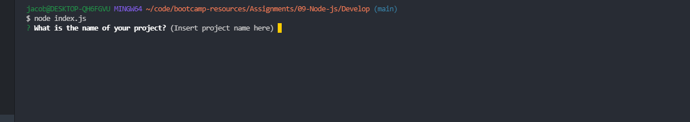
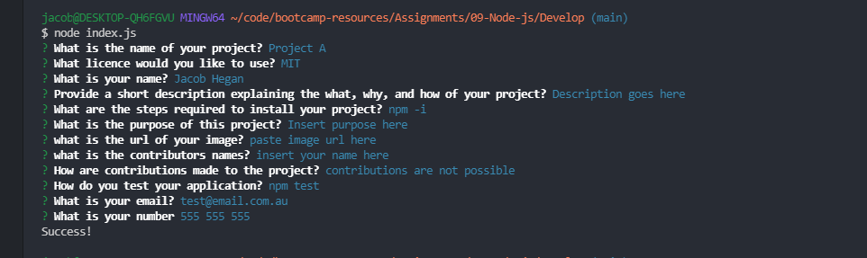
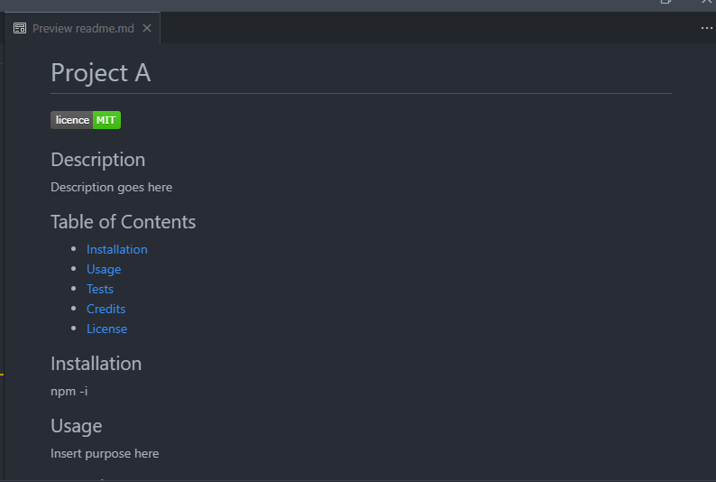

# 09-professional-readme-generator
Node.JS

by Jacob Hegan - UWA Bootcamp Feb 2021
___

[Video Link](https://drive.google.com/file/d/1MvwB67XNHe56bstXAj1UecsJXw-ZaaZy/view)

[Repository](https://github.com/heganjr/09-professional-readme-generator)


## The Task

```md
GIVEN a command-line application that accepts user input
WHEN I am prompted for information about my application repository
THEN a high-quality, professional README.md is generated with the title of my project and sections entitled Description, Table of Contents, Installation, Usage, License, Contributing, Tests, and Questions
WHEN I enter my project title
THEN this is displayed as the title of the README
WHEN I enter a description, installation instructions, usage information, contribution guidelines, and test instructions
THEN this information is added to the sections of the README entitled Description, Installation, Usage, Contributing, and Tests
WHEN I choose a license for my application from a list of options
THEN a badge for that license is added near the top of the README and a notice is added to the section of the README entitled License that explains which license the application is covered under
WHEN I enter my GitHub username
THEN this is added to the section of the README entitled Questions, with a link to my GitHub profile
WHEN I enter my email address
THEN this is added to the section of the README entitled Questions, with instructions on how to reach me with additional questions
WHEN I click on the links in the Table of Contents
THEN I am taken to the corresponding section of the README
```

### How to Use Application

1. Ensuring you have the latest version of Node.JS installed, within your terminal or command prompt navigate to the file location

2. Type "node index.js"

3. Follow the prompts

*Congratulations your README is generated*

### Screenshots



___



___



END

